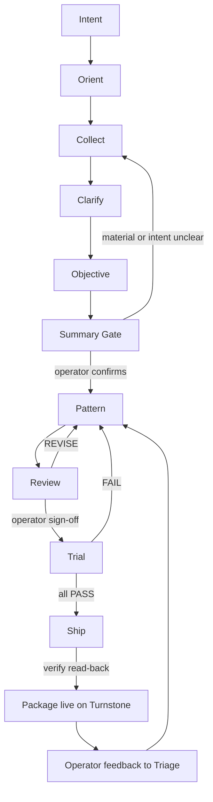

# Process Engine

**Turn your working knowledge, examples, and operating requirements into a Turnstone-native agent package — persona, project, skills, templates — through a gated pipeline with your sign-off at every step.**

Process Engine is a persona-and-skills generator for Turnstone: tell it what you want, share what you have, and it produces a complete Turnstone package through a gated pipeline. The engine runs on prompts. Turnstone's native governance mechanisms (prompt policy, advisory judge) enforce the gates mechanically.

> Process Engine v1.9.6 is the **prompts-only, Turnstone-native** reference implementation. The prompt+code successor is [Method Factory](https://github.com/RedEyeNinja-BKK/Method-Factory).

## What it does

Tell it what you want to build, share any material you already have, and it produces a complete Turnstone-native package — project, persona, skills, templates — through a gated pipeline:

Every gate requires operator sign-off. Turnstone's native prompt policy and advisory judge enforce this mechanically — the engine doesn't need to recite governance policy; Turnstone handles it.

> See a real run end to end: [case study: a shop package built, trialed, and shipped](case-study/case-study-first-run.md).

## What makes it different

- **Intent before output** — collects what you already have, clarifies what you mean, asks what "good" looks like *before* it writes anything.
- **Input-agnostic intake** — links, pasted text, files, store pages, existing skills, documents. Everything is assessed; incorporated or excluded with a recorded reason.
- **Gates, not guesswork** — nothing ships without your review; nothing ships untried. Turnstone's native governance enforces these mechanically.
- **Adapts, never copies** — techniques are extracted and attributed, original instructions authored. Sources traced from intent through deployment.

Process Engine is domain-neutral in package structure, artifact-specific, and runtime-aware. It's been exercised on Etsy store management, supplement product listings, incident response, employee onboarding, database backup operations, and financial planning advisories — not just software engineering.

## Why Turnstone

Process Engine runs on Turnstone because Turnstone's governance surface is what the engine produces. Every generated package includes governance objects — prompt policy and advisory judge rules — that Turnstone enforces mechanically. The engine's "operator is the gate" philosophy maps directly to Turnstone's native approval surfaces.

| Harness | Governance surface |
|---|---|
| **Turnstone** | Full — projects, personas, roles, policies, prompts, judge, audit |
| Hermes | Agent runtime (skills, toolsets, tasks) — no governance objects |
| OpenClaw | Agent + channels (Discord/LINE) — emission-focused |
| Claude | Commercial harness — no governance layer |

The engine is built for Turnstone and deployed on Turnstone. Turnstone's native mechanisms — projects, personas, skills, prompt templates, the judge — are the engine's platform and enforcement layer. The model generates packages; Turnstone owns the guardrails.

## The engine's components

### Skills (6)

| Skill | Role |
|---|---|
| `process-engine-core` | Entry point — identity, pipeline, routing, standards checklist. Load first. |
| `process-engine-pattern-author` | Generates the project/persona/skills package for an intent, to standard. |
| `process-engine-review` | Review gate — spec compliance, standards, scope, evidence, acceptance criteria. Operator sign-off is mandatory. |
| `process-engine-trial` | Trial harness — cases and trigger sets that prove an artifact performs correctly. |
| `process-engine-ship` | Deploys approved, trialed packages via Turnstone's native API; verifies by read-back. |
| `process-engine-triage` | Feedback sensor — converts issues/discussions into engine improvements. |

### References (7, loaded on demand)

`standards.md` · `safety.md` · `evidence-library.md` · `skill-anatomy.md` · `best-practices.md` · `intake.md` · `governance.md`

### Persona & templates

`persona.md` — the engine's identity. `templates/` — six session initial prompts.

## Who this is for

**Good fit:**
- You use Turnstone and want to build agent packages (personas, skills, templates) with engineering discipline
- You care about intent clarification, evidence, review gates, and deployment verification
- You're comfortable working with an agent that asks questions before generating

**Not a fit:**
- You want a one-click UI or web interface (this is a skill-based workflow)
- You don't use Turnstone — see [Method Factory](https://github.com/RedEyeNinja-BKK/Method-Factory), the platform-agnostic prompt+code successor

## Using Process Engine

A session follows a fixed shape — the engine **collects before it creates**:

1. **You say what you want.** "I want a skill that tracks workout routines."
2. **The engine collects.** Anything to work from? A link, pasted text, a file, your store or product pages — after each addition it asks "Anything else?" until you say that's all.
3. **It clarifies, informed by what you shared.** Questions reference your material and distinguish an example to match from one to improve on.
4. **It asks what "good" looks like.** Even a vague vision of the end result shapes the objective.
5. **It confirms what it's working from.** "Working from: N links + M text blocks (k sources unknown). Intent: X. Good looks like: <vision>. Generate?"
6. **You watch it through the gates.** Pattern → Review → Trial → Ship, with your sign-off at each one. Nothing ships without you.

The engine never copies what you give it — it extracts the techniques and intent, authors original instructions, and attributes the sources it knows. And it's a helper, not a police officer: when something is worth knowing it tells you plainly and stays out of the way — you decide.

## Deploying

Process Engine runs on Turnstone. Full governance included:

1. Create the project: `POST /v1/api/projects`.
2. Create the persona: `POST /v1/api/admin/personas` (base_prompt = `persona.md`).
3. Create the six skills and six templates via the skills API (prompt_templates store); attach the seven references as skill resources on `process-engine-core`.
4. Create the engine's governance wiring: the prompt policy and advisory judge rules.
5. Verify by reading every created object back (GET), then run trials as the verification gate.

## Origin story

Process Engine began as a prompt-only experiment and proved itself in a [real end-to-end run](case-study/case-study-first-run.md) — a shop package built, trialed, and shipped. That run established the pipeline: Intent → Collect → Clarify → Objective → Summary Gate → Pattern → Review → Trial → Ship.

v1.9.5 strips the engine back to that original intent. Everything added during the evaluator era — tier systems, manifest mechanics, first-response discipline rules, governance boilerplate, release sealing — has been removed. Turnstone's native governance handles enforcement. The prompts focus on conversation and content generation.

The evaluator-era content and evidence are preserved at [Method Factory](https://github.com/RedEyeNinja-BKK/Method-Factory), the prompt+code successor.

## License

MIT — see [LICENSE](LICENSE).

## Docs

- [Architecture](docs/architecture.md)
- [Governance usage](docs/governance-usage.md)
- [Spec compliance](docs/spec-compliance.md)
- [Case study: first live run](case-study/case-study-first-run.md)

## Credits

- **Generation basis:** [addyosmani/agent-skills](https://github.com/addyosmani/agent-skills) (MIT) — engineering discipline catalog
- **Format standard:** [agentskills/agentskills](https://github.com/agentskills/agentskills) (Apache-2.0 / CC-BY-4.0) — Agent Skills open format
- **Platform:** native [turnstone](https://github.com/turnstonelabs/turnstone) mechanisms (projects, personas, skills, prompt templates, judge)
