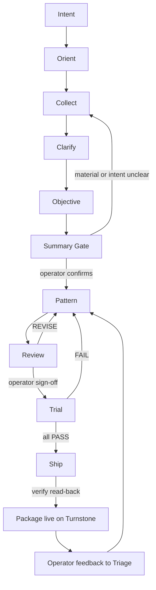

# Architecture

Process Engine is a Turnstone-native agent-skill framework: a persona, six skills,
seven references, and six session templates that drive a gated authoring pipeline.
Turnstone provides the native governance surfaces the engine uses for persistent
context and advisory evidence; operator approval remains the final authority at
the defined gates. The model generates packages; Turnstone supplies the native
mechanisms around the workflow.

For the platform-agnostic prompt+code successor, see
[Method Factory](https://github.com/RedEyeNinja-BKK/Method-Factory).

Turnstone is the engine's platform. The engine is built for Turnstone,
deployed on Turnstone, and uses Turnstone's native governance surfaces.

## Components

```
Process Engine (project)
├── persona: process-engine-generator   # canonical generator persona (repo persona.md; deploy under a distinct generator identity so it does not collide with any development/maintenance persona)
├── skills/ (6)
│   ├── process-engine-core        # entry + routing
│   ├── process-engine-pattern-author
│   ├── process-engine-review
│   ├── process-engine-trial
│   ├── process-engine-ship
│   └── process-engine-triage
├── references/ (7, on core)       # loaded on demand
│   ├── standards.md               # standards checklist
│   ├── safety.md                  # heads-up practice
│   ├── evidence-library.md        # named basis sources
│   ├── skill-anatomy.md           # SKILL.md anatomy
│   ├── best-practices.md          # catalog + spec index
│   ├── intake.md                  # input-agnostic intake
│   └── governance.md              # Turnstone governance objects
└── templates/ (6)                 # session initial prompts
```

## The pipeline



**Pipeline gates** (v1.9.6): the meaningful operator gates are the Summary Gate (confirm material/intent/objective before generation), Review (operator accepts the reviewed package), Trial (operator accepts trial evidence/readiness), and Ship (operator authorizes deployment). Not every conversational stage is an approval gate — the pipeline stays conversational between the defined gates. Turnstone's native prompt policy provides durable contextual guidance and the advisory judge provides review/trial evidence; neither silently replaces operator approval.

- **Orient** — declare scope and ask what to build.
- **Collect** — the engine invites material (links, text, files, docs) and
  routes each item through intake (input-agnostic, extract-author-original).
  Exits on any non-material reply.
- **Clarify** — one question at a time, informed by the collected material.
- **Objective** — the engine asks what "good" looks like; the vision seeds
  the package's objective and outcomes.
- **Summary Gate** — summary of material + intent + vision; operator confirms.
- **Pattern** — eligibility gate decides the shape; pattern-author designs
  the package to standard, names evidence, builds per-package safeguards
  for risk-relevant intents, writes acceptance criteria. Output: DRAFT.
- **Review** — standards checklist, spec-compliance check, anatomy check,
  coverage check, adversarial pass. Verdict with evidence; operator sign-off
  is the gate.
- **Trial** — case set from acceptance criteria + scope surface (happy path,
  gray zone, escalation, boundary, trigger set), actual vs expected
  recorded. Depth scales with the package's domain.
- **Ship** — confirm gates, define rollback, deploy the package via
  Turnstone's native API (project, persona, skills, templates, governance
  objects), verify by read-back, record evidence.

## Release integrity

`process-engine.toml` is repository release metadata (version, lineage,
artifact counts). `tools/validate.py` + the GitHub Actions structural
validation check enforce committed-repository consistency: version
consistency, link resolution, frontmatter validity, embedded-reference
equality. A green structural check is not behavioral proof or a release
gate — behavioral trials establish product behavior, Turnstone provides
runtime/governance, and the operator approves merge/release/deployment.
The evaluator-era steps have been retired. Evaluator evidence is preserved
at [Method Factory](https://github.com/RedEyeNinja-BKK/Method-Factory).

## Native mechanisms used

| Artifact | Native mechanism |
|---|---|
| Project | `POST /v1/api/projects` |
| Persona | `POST/PATCH /v1/api/admin/personas` |
| Skills + templates | skills API (`prompt_templates` store): `POST/PUT /v1/api/admin/skills` |
| References | skill resources: `POST /v1/api/admin/skills/{id}/resources` |
| Governance enforcement | Prompt policy (content-only, no tool_gate) + advisory judge rules |
| Session start | prompt templates (orientation + starters) |

## Store format vs repository format

Turnstone's native store keeps skill metadata in API fields (name, description,
content), with frontmatter shown as a `yaml` code block inside content. The
Agent Skills open format standard uses real YAML frontmatter at the top of
`SKILL.md`. The repository keeps the spec-valid form; the native store keeps
its native form. Content is otherwise identical.
